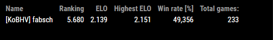
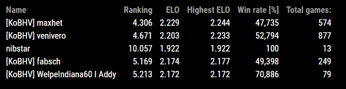

# MMM-AOE2-STATS

This is a module for the [MagicMirror²](https://github.com/MichMich/MagicMirror/).
It will display the aoe2.net leadder stats for players id's.

# PREVIEW PICTURE

RM 1v1:


RM Team:


## Installation

1. Clone this repo into `~/MagicMirror/modules` directory.
2. Go to `~/MagicMirror/modules/MMM-AOE2-STATS` directory and do `npm install`

## Using the module

To use this module, add the following configuration block to the modules array in the `config/config.js` file:
```js
var config = {
{
	module: "MMM-AOE2-STATS",
	position: "bottom_right",
	config: {
		players: ['912329'],
		updateInterval: 20,
		showTeamStats: true,
		showGameWins: false,
		showGameLosses: false,
		showTotalGames: true,
		showWinPercentage: true
	}
}
}
```

## Configuration options

| Option               | Description
|----------------------|-----------
| `players`            | *Required* Player ID to display.
| `updateInterval`     | *Optional* Update time <br><br>**Type:** `int`(minute) <br>Default 20  (= 20 minute).
| `showTeamStats`      | *Optional* If <b>true</b> module will display the RM-Team stats otherwise the 1v1 stats if available.
| `showGameWins`       | *Optional* If <b>true</b> module shows how many games player has won.
| `showGameLosses`     | *Optional* If <b>true</b> module shows how many games player has loose.
| `showTotalGames`     | *Optional* If <b>true</b> module shows how many games player has played.
| `showWinPercentage`  | *Optional* If <b>true</b> module shows the percentage of won games. 
